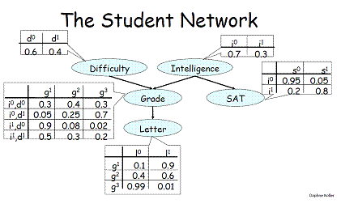
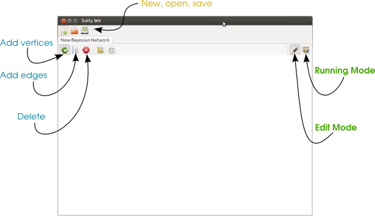
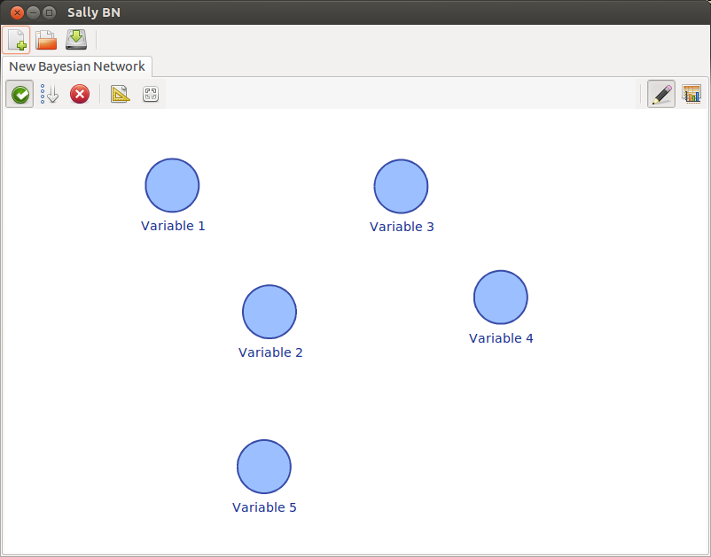
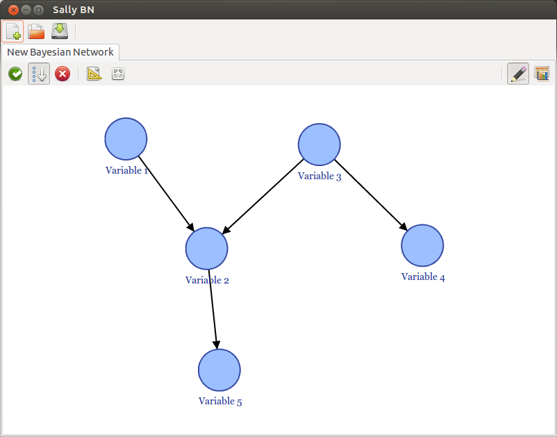
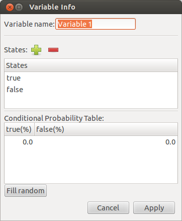
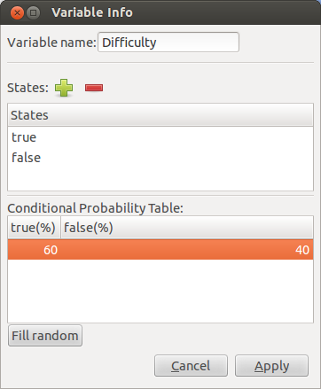
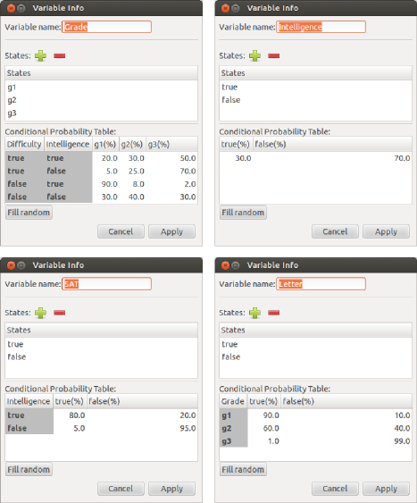
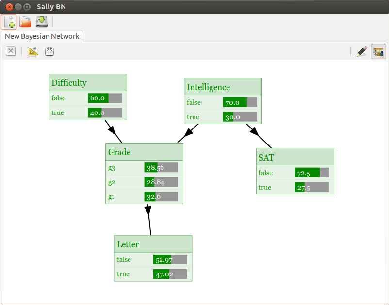
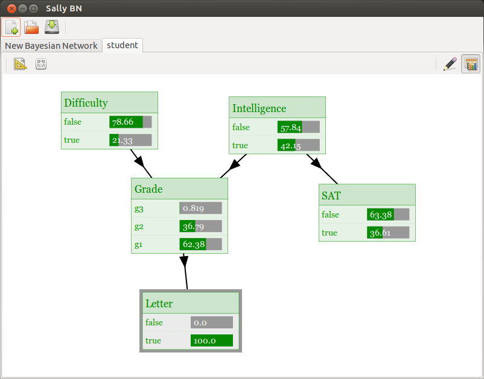

.. _intro:

*******************************
A Bayesian Network in 2 minutes
*******************************
In this tutorial about creating a simple Discrete Bayesian
Network(BN). The resultant is the BN of the
Probabilistic Graphical Models course. The student network:

Run Sally-BN
===============
Install and run Sally-BN (more information about installation :ref:`installation`).
The main window and the buttons descriptions are the next:

1. Creating variables
=================

The initial step is defining the variables (represented as vertices) of the Bayesian Network.
Just click on the button "Add vertices" and click on the white space to create a node.
The result of doing it five times looks like this:

2. Connecting variables
===================

Click on the button "Add edges". Then, click on the source vertex (cause) and click on the target node (effect).
It defines the relationship between two vertices, where the source vertex is the cause and the target is the effect.
The result should look like this:

3. Defining variable names and distributions
=========================================
To edit the vertex attributes, double click on vertex "Variable 1". It must show the window:

Edit the form with the params below:

By the same way, edit variables 2, 3 ,4, and 5:

4. Solve the Bayesian Network
=============================
Click on the button *solve mode* to validate the network and compute the marginal distributions:

5. Add evidences
================
Simply click over the state that you want to add evidence. For example, click on the state **False** of the variable **Letter**.
Then, all the marginal probabilities are updated automatically:

Congratulations!! You have created and solved your first Bayesian Network in Sally-BN!